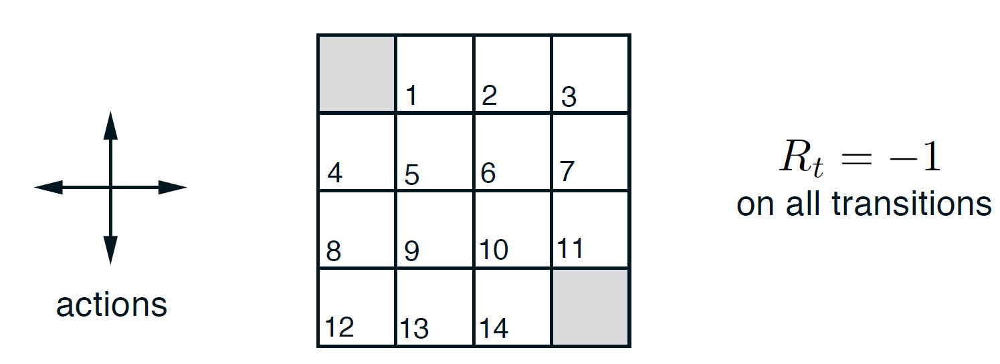

class: center, middle

# Chap 4 of   Sutton & Barto: Reinforcement Learning

## トップエスイー勉強会

## 2019/09/03

担当: 田辺

---

## 復習: 記号など

* MDP (Malkov Decision Process)
    * `$\mathcal{S}$`: 状態
    * `$\mathcal{A}$`: 行動
    * `$\mathcal{R} \subset \mathbb{R}$`: 報酬
    * `$p(s', r \mid s, a)$` : ダイナミクス関数 (確率を返す)
* `\(S_t, A_t, R_t\)` (`$t$` は時刻 0, 1, ...) : 対応する確率変数
* `$G_t := \sum_{k = 0}^\infty \gamma^k R_{t+k+1}$`: 収益, 
  `$\gamma$`: 割引因子
* ポリシー関数 `$\pi(a \mid s)\quad$`   (確率を返す)
* 価値関数 `$v_\pi(s) := \mathbb{E}_\pi[G_t \mid S_t = s]$`
* 行動価値関数 `$q_\pi(s, a) := \mathbb{E}_\pi[G_t \mid S_t = s, A_t = a]$`
* 最適価値関数 `$v_*(s) := \max_\pi v_\pi(s)$`
* 最適行動価値関数 `$q_*(s, a) := \max_\pi q_\pi(s, a)$`

---

## 復習: Bellman 最適方程式

`\begin{equation}
  v_*(s) 
  = \max_a\mathbb{E}[ R_{t+1} + \gamma v_*(S_{t+1}) \mid S_t = s, A_t = a ]
    \tag{4.1}
\end{equation}`

`\begin{equation}
  q_*(s, a) 
  = \mathbb{E}[ R_{t+1} + \gamma \max_{a'} q_*(S_{t+1}, a') 
               \mid S_t = s, A_t = a ]
    \tag{4.2}
\end{equation}`

* `$v_*$` や `$q_*$` に関する方程式
    * 「最適価値関数として，局所的に辻褄が合っている」
* $V$ が最適価値関数 $\iff v_* = V$ が(4.1)の解．
* $Q$ が最適行動価値関数 $\iff q_* = Q$ が(4.2)の解．
* 参照: Banachの不動点定理 (付録)
* 第4章では，この方程式を満たす関数を求める方法を扱う．

---

## 4.1 Policy Evaluation

* まず，`$v_\pi$` の計算方法を考える．
    * ポリシー評価とか予測問題とか呼ばれる．
* 定義より:
`\begin{equation}
v_\pi(s) = \sum_a \pi(a \mid s)
    \sum_{s', r} p(s', r \mid s, a) [ r + \gamma v_\pi(s') ]
  \tag{4.4}
\end{equation}`
* 4.4 は，`$ |\mathcal{S}| $` 個の連立方程式なので，解ける．
    * `0 < $\gamma < 1$` または パスはすべて有限と仮定している．
    * (これも，不動点定理が適用できる)

---

### アルゴリズム: 反復ポリシー評価

* 入力: `$\pi$`: 評価するポリシー
* アルゴリズムパラメタ: `$\theta$`: 反復停止判断閾値
* 初期化: `$V(s)$`を任意の値にする．ただし，終端状態 $s$ については
  $V(s) = 0$ とすること．
* 反復:
    * $\Delta \leftarrow 0$
    * 各 $s \in\mathcal{S}$ について
        * $v \leftarrow V(s)$
		* `$V(s) \leftarrow \sum_a \pi(a \mid s) \sum_{s',r} p(s', r \mid s, a) [r + \gamma V(s')] $`
		* `$\Delta \leftarrow \max(\Delta, | v - V(s) |)$`
* $\Delta < \theta$ となるまで

---

### 例4-1

.center[]

* 落ちそうになったらそこに留まる．
* 灰色マスは停止状態．

---

## 4.2 Policy Improvement

* しばらく，決定的なポリシー (1つ以外の選択肢の確率は0) 
  $\pi$ を考える．
  (確率 $\pi(s,a)$ の代わりに $\pi(s)$ で選んだ選択肢を表すことにする)
* $s \in \mathcal{S}$，$a \in \mathcal{A}$ として，
  `$q_\pi(s, a) > v_\pi(s)$` ならば，$\pi(s)$ の代わりに $a$ を選ぶように
  変更した方が良いように思われる．実際次が成り立つ:

#### ポリシー改善定理

2つの決定的なポリシー $\pi$ と $\pi'$ について，
任意の $s\in\mathcal{S}$ に対して `$q_\pi(s, \pi'(s)) \geq v_\pi(s)$`
ならば，
任意の$s\in\mathcal{S}$に対して`$v_{\pi'}(s) \geq v_\pi(s)$`
である．

---

### ポリシー改善

* $\pi$ に対して，
すべての状態でポリシー改善定理を適用して，以下の改善ポリシー $\pi'$ を得る:
* `\begin{align}
\pi'(s) &:= \text{arg}\max_a q_\pi(s, a)  \\
  &= \text{arg}\max_a \sum_{a',r} p(s',r \mid s,a)
     [ r + \gamma v_\pi(s')]
  \tag{4.9}
\end{align}`
* この結果，もし $\pi = \pi'$ であれば，(4.9) は，Bellman 方程式になる．
  決定的ポリシーは有限個しかないので，
  (Bellman 方程式の解の一意性が成り立つのであれば)
  ポリシー改善を繰り返すと最適解に到達する．
* 確率的ポリシーの場合も似たようなもの．

---

## 4.3 Policy Iteration

* ポリシー評価とポリシー改善を交互に行って，最適ポリシーを得る方法を，
  ポリシー反復と呼ぶ．
* アルゴリズムは次スライド

---

1. 初期化: $s\in\mathcal{S}$に対して，$V(s)$ と
   $\pi(s)$ を任意に取る．
2. ポリシー評価
    * 反復:
        * $\Delta \leftarrow 0$
        * 各 $s \in\mathcal{S}$ について
            * $v \leftarrow V(s)$
    		* `$V(s) \leftarrow \sum_{s',r} p(s', r \mid s, \pi(s)) [r + \gamma V(s')] $`
    		* `$\Delta \leftarrow \max(\Delta, | v - V(s) |)$`
    * $\Delta < \theta$ となるまで
3. ポリシー改善
    * stable $\leftarrow$ true
	* 各 $s \in\mathcal{S}$ について
	    * old $\leftarrow \pi(s)$
		* `$\pi(s) \leftarrow \text{argmax}_a \sum_{s',r} p(s',r \mid s,a)[r + \gamma V(s')]$`
        * old $\neq \pi(s)$ なら，stable $\leftarrow$ false
	* stable = true なら，`$v_\pi := V$` と `$\pi_* := \pi$` を返して終了．
	  そうでなければ2に戻る．

---

### 例4.2 Jack's Car Rental

* レンタカー営業所A, B
    * 駐車スペース 20台
* 1日あたりの貸出依頼台数と返却依頼台数は，Poisson分布．
    * $ \displaystyle{p(\lambda, n) = \frac{\lambda^n}{n!}e^{-\lambda}}$
	* $\lambda$ の値: Aの貸出: 3, Aの返却: 3, Bの貸出: 4, Bの返却: 2
    * スペースを超えて返却はできない．無い車は貸せない．
* 貸出すると1台当たり10ドルの利益 (貸出し当日のみ)．
* 夜に，A,B間で車を5台まで移動できる．1台当たり2ドルの費用発生．

$\gamma = 0.9$ で，最適ポリシー関数と価値関数を決定せよ．

---

## 4.4 Value Iteration

* ポリシー反復の弱点: 毎回のポリシー評価で全状態を何度も計算．
* ポリシー評価を，途中で切り上げる手法がいろいろある．
* 反復を1回で終わらせる手法を，価値反復と呼ぶ．

アルゴリズムは次のようになる．

1. $V$ を今までと同様に初期化．
2. Repeat: 
    * $v \leftarrow V$
    * 各 $s \in \mathcal{S}$ に対して
      `$V(s) \leftarrow \max_a\sum_{s',r} p(s',r\mid s,a)[r + \gamma V(s')]$`
    * Until: `$\max_s | v(s) - V(s) | < \theta$`
3. 出力:
    * 価値関数 $V$
    * ポリシー `$\pi(s) := \text{argmax}_a\sum_{s',r} p(s',r\mid s,a)[r + \gamma V(s')]$`

---

### 例4.3  ギャンブラー

* 最初の所持金: 1以上99以下
* 表の出る確率が `$p_h$` (0.5とは限らない) のコイン
* 以下を所持金がなくなるか，所持金が100以上になるまで繰り返す．
    * 所持金からいくらか賭ける
    * コインを投げる．
    	* 表が出たら，賭け金は戻り，さらに同額もらえる．
	    * 裏が出たら，掛け金は没収
* 所持金を100以上にできれば成功 (reward = 1)， 
  できなければ失敗 (reward = 0)

最適なポリシー関数と価値関数を決定せよ．

---

### 4.5 Asynchronous Dynamic Programming

* DPの弱点: 全状態集合をなめる
    * バックギャモンの状態集合の大きさは $10^{20}$ 以上．
* 非同期DP
    * 状態の更新順序制限を緩める．一部の状態を頻繁に更新してもよい．
* 例:
    * $k$回目の更新で，1状態 `$s_k$` のみを更新．
	* $0 \leq \gamma < 1$ で，すべての $s \in \mathcal{S}$ が
	  更新列に無限回現れれば，`$v_*$` への収束が保証される．
* いつでも計算量が減るわけでは無いが，
  うまくやれば早く有益な情報が得られることがある．→ 第8章
* エージェントがMDP上で走るのと並行して対話的DPアルゴリズムを動かす．
    * 例: エージェントが現在いる状態を更新対象にする．

---

### 4.6 Generalized Policy Iteration (GPI)

.rightFloat[]

* ポリシー評価とポリシー改善が交互に動作する．
    * 粒度にはさまざまな場合がある．
    * GPI: これらの総称．
	  ほぼすべての強化学習の方式はGPIとみなせる．
* 安定状態にいたると，Bellman 方程式の解になるので，最適解である．

---

### 4.7 Efficiency of Dynamic Programming

* DPは大きな問題は解けないが，他のMDPの解法より効率的．
    * $|\mathcal{S}|, |\mathcal{A}|$ の多項式時間
	* 探索空間は $|\mathcal{S}|^{|\mathcal{A}|}$
    * 線型計画法もあるが，DPの方が大きな問題に強い．
* 次元の呪い
    * DPのせいではない．
* 百万単位の状態をもつMDPがDPで解かれている．
* ポリシー反復も価値反復も用いられる．
    * 一般的にどちらが良いとは言えない．
	* 理論的な最悪評価より，たいてい速い．初期値に依存．
* 状態数が多いときには非同期DPが有効．
    * 最適解には少数の状態しか出てこないことがある．

---

### 付録: Banach の不動点定理

* `$(V, \| \cdot \|)$`: 完備ベクトル空間．
    * 完備: ノルムに関するコーシー列が収束
* $0 < \gamma < 1$
* $T: V \to V$: $\gamma$-縮小写像
    * i.e., `$\|Tu - Tv\| \leq \gamma\|u - v\|$`

このとき，以下が成立する．

1. $T$ は，ただ一つの不動点 $v$ を持つ．
1. 任意の `$v_0\in V$` に対し，`$v_{n+1} = Tv_n$` で定義される列 `$\{v_n\}$`
   は，不動点 `$v$` に収束する．より詳しく，
   `$$ \| v_n - v \| \leq \gamma^n \| v_0 - v\| $$`

(ベクトル空間の構造は使っていない．完備距離空間でありさえすれば良い．)

---

証明

---

#### $V$ が最適価値関数 $\iff v_* = V$ がBellman最適方程式の解

##### 割引率 $0 < \gamma < 1$ である場合

* ノルムとしては `$\|\cdot\|_\infty$` を用いる．
    * 成分の絶対値のうち，最大のもの
* `$Tv(s) = \max_a\sum_{s',r}p(s',r \mid s,a)[r + \gamma v(s')] $`
  が，$\gamma$-縮小写像であることを言えば良い．
`\begin{align}
|Tv_1(s) - Tv_2(s)| 
  & \leq 
  \max_a\sum_{s',r}p(s',r \mid s,a)[\gamma\cdot |v_1(s') - v_2(s')|] \\
  & \leq \gamma \cdot \| v_1 - v_2 \|_\infty
\end{align}`

---

##### 終端状態があって，`$\gamma=1$` の場合

* 終端状態を$t$とする．
* ポリシー$\pi$ がproper 
  `$\stackrel{{\rm\scriptsize def}}{\iff}$`
  $n \in \mathbb{N}$ が存在して，すべての状態$x$に対して，
  `$ \textrm{Prob}(x_n \neq t \mid x_0 = x, \pi) < 1$`.
* 任意のポリシーがproperなら，$T$ は，あるノルムに関して縮小写像である．
  (したがって，Bellman 最適方程式の解は一意で，任意の初期値から
  $T$の繰返し適用で収束する．)
* もっと緩い条件で，Bellman最適方程式の解の一意性と任意の初期値からの
  収束を言う定理もある．

---

付録は，
http://researchers.lille.inria.fr/~lazaric/Webpage/MVA-RL_Course14_files/notes-lecture-02.pdf
によった．

     

.center[(End of Slides)]
